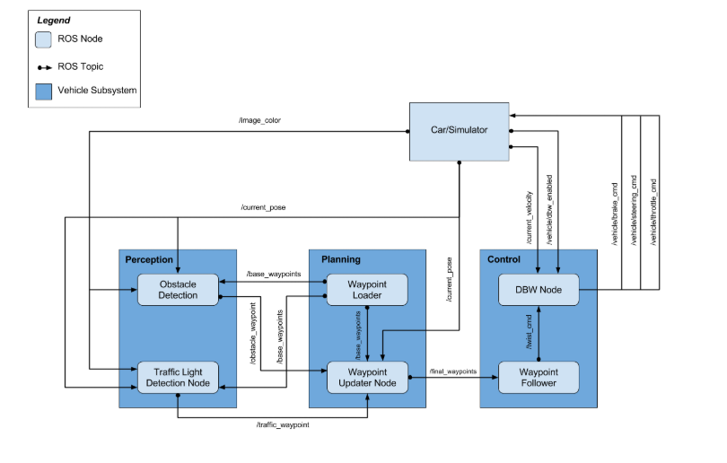
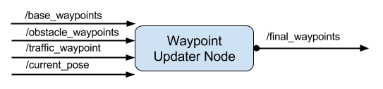
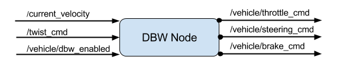
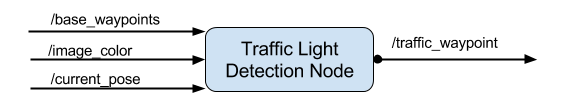

# CarND-Capstone-Project

This is my final project submission for the Udacity Self-Driving Car Engineer Nanodegree. The project entails waypoint tracking, vehicle control and traffic light classification. 
The code will be tested on a simulator, as well as on a real world car by Udacity. 

I have worked on this project alone, due to practical reasons. Please se the "System Overview" section at the bottom of this README for an overview of the project. 
The focus of the System Overview is the parts of the code that I have modified.  

**Members:**
Full Name | E-mail|Student 
-----| ----- | ----- 
Øystein Lasson | oystein.lasson@gmail.com | Øystein L.

# Repository Overview and Instructions

This is the project repo for the final project of the Udacity Self-Driving Car Nanodegree: Programming a Real Self-Driving Car. For more information about the project, see the project introduction [here](https://classroom.udacity.com/nanodegrees/nd013/parts/6047fe34-d93c-4f50-8336-b70ef10cb4b2/modules/e1a23b06-329a-4684-a717-ad476f0d8dff/lessons/462c933d-9f24-42d3-8bdc-a08a5fc866e4/concepts/5ab4b122-83e6-436d-850f-9f4d26627fd9).

Please use **one** of the two installation options, either native **or** docker installation.

### Native Installation

* Be sure that your workstation is running Ubuntu 16.04 Xenial Xerus or Ubuntu 14.04 Trusty Tahir. [Ubuntu downloads can be found here](https://www.ubuntu.com/download/desktop).
* If using a Virtual Machine to install Ubuntu, use the following configuration as minimum:
  * 2 CPU
  * 2 GB system memory
  * 25 GB of free hard drive space

  The Udacity provided virtual machine has ROS and Dataspeed DBW already installed, so you can skip the next two steps if you are using this.

* Follow these instructions to install ROS
  * [ROS Kinetic](http://wiki.ros.org/kinetic/Installation/Ubuntu) if you have Ubuntu 16.04.
  * [ROS Indigo](http://wiki.ros.org/indigo/Installation/Ubuntu) if you have Ubuntu 14.04.
* [Dataspeed DBW](https://bitbucket.org/DataspeedInc/dbw_mkz_ros)
  * Use this option to install the SDK on a workstation that already has ROS installed: [One Line SDK Install (binary)](https://bitbucket.org/DataspeedInc/dbw_mkz_ros/src/81e63fcc335d7b64139d7482017d6a97b405e250/ROS_SETUP.md?fileviewer=file-view-default)
* Download the [Udacity Simulator](https://github.com/udacity/CarND-Capstone/releases).

### Docker Installation
[Install Docker](https://docs.docker.com/engine/installation/)

Build the docker container
```bash
docker build . -t capstone
```

Run the docker file
```bash
docker run -p 4567:4567 -v $PWD:/capstone -v /tmp/log:/root/.ros/ --rm -it capstone
```

### Port Forwarding
To set up port forwarding, please refer to the [instructions from term 2](https://classroom.udacity.com/nanodegrees/nd013/parts/40f38239-66b6-46ec-ae68-03afd8a601c8/modules/0949fca6-b379-42af-a919-ee50aa304e6a/lessons/f758c44c-5e40-4e01-93b5-1a82aa4e044f/concepts/16cf4a78-4fc7-49e1-8621-3450ca938b77)

### Usage

1. Clone the project repository
```bash
git clone https://github.com/udacity/CarND-Capstone.git
```

2. Install python dependencies
```bash
cd CarND-Capstone
pip install -r requirements.txt
```
3. Make and run styx
```bash
cd ros
catkin_make
source devel/setup.sh
roslaunch launch/styx.launch
```
4. Run the simulator

### Real world testing
1. Download [training bag](https://s3-us-west-1.amazonaws.com/udacity-selfdrivingcar/traffic_light_bag_file.zip) that was recorded on the Udacity self-driving car.
2. Unzip the file
```bash
unzip traffic_light_bag_file.zip
```
3. Play the bag file
```bash
rosbag play -l traffic_light_bag_file/traffic_light_training.bag
```
4. Launch your project in site mode
```bash
cd CarND-Capstone/ros
roslaunch launch/site.launch
```
5. Confirm that traffic light detection works on real life images

# System Overview

The following diagram, taken from Lesson 4 (Project Overview) provides an overview of the ROS nodes used in this project,
as well as the communication between them. 

<p align="center">
     
     <br>Courtesy of Udacity
</p>

This project strucutre is broken down into serveral parts outlined in more detail in their respective sections. 

### Waypoint Updater Node

The [Waypoint updater ](https://github.com/olasson/Term3-P2-CarND-Capstone/tree/master/ros/src/waypoint_updater/waypoint_updater.py) 
Node attempts to update the target velocity in accordance with the traffic light data. Obstacle detection can also be included here, but for this
project I focused on traffic light detection only. A waypoint consists of coordinates on the track, which the car uses to plan its trajectory. This node is also responsibe for decelerating the cars
path when approaching a read light. 

<p align="center">
     
     <br>Courtesy of Udacity
</p>

This node has the following topics (ros buses) as inputs:
* `/base_waypoints`: Contains all waypoints along the track. These are published to the car only once at program start. 
* `/obstacle_waypoint`: Contains the waypoint positions of obstacles. Not used in this project, since the simulator does not contain obstacles. 
* `/traffic_waypoint`: Contains the waypoints where the car should stop when detecting traffic lights.
* `/current_pose`: Contains the current position of the car. This informations comes from the simulator itself. 

### Drive by Wire (DBW) Node


The [Drive by Wire (DBW)](https://github.com/olasson/Term3-P2-CarND-Capstone/tree/master/ros/src/twist_controller/dbw_node.py)
Node is the basis for the cars control system. This node is responsible for controlling the throttle, braking and steering. 

<p align="center">
     
     <br>Courtesy of Udacity
</p>

This node has the following topics (ros buses) as inputs:
* `/current_velocity`: Contains information from the simulator used to determine linear velocity. 
* `/twist_cmd`: Contains the information from the simulator used to generate throttle, brake and steering outputs. 
* `/vehicle/dbw_enabled`: Contains a boolean value, indicating wether dbw is enabled or not. 

The [Twist controller](https://github.com/olasson/Term3-P2-CarND-Capstone/tree/master/ros/src/twist_controller/twitst_controller.py)
is a simple PID controller that sets the throttle based on a comparison between current throttle and target throttle. 

The *Yaw Controller* converts the target linear and angular velocities into a steering angle. It also uses additional information about the car
such as steering ratio etc. 

The *Brake Controller* determines how aggressively the car decelerates. It uses additional information about the car
such as car mass and wheel radius etc. 

### Traffic Light Detection Node 

The traffic light detection node is responsible for detecting stop and star conditions with respect to traffic lights. 

<p align="center">
     
     <br>Courtesy of Udacity
</p>

This node has the following topics (ros buses) as inputs:
* `/base_waypoints`: Contains all waypoints along the track. These are published to the car only once at program start. 
* `/image_color`: Contains an image stream captured by the cars front camera. 
* `/current_pose`: Contains the current position of the car. This informations comes from the simulator itself. 

This node consists of the [Traffic light classifier](https://github.com/olasson/Term3-P2-CarND-Capstone/tree/master/ros/src/tl_detector/light_classification/tl_classifier.py)
 and the [Traffic light detector](https://github.com/olasson/Term3-P2-CarND-Capstone/tree/master/ros/src/tl_detector/tl_detector.py).
 